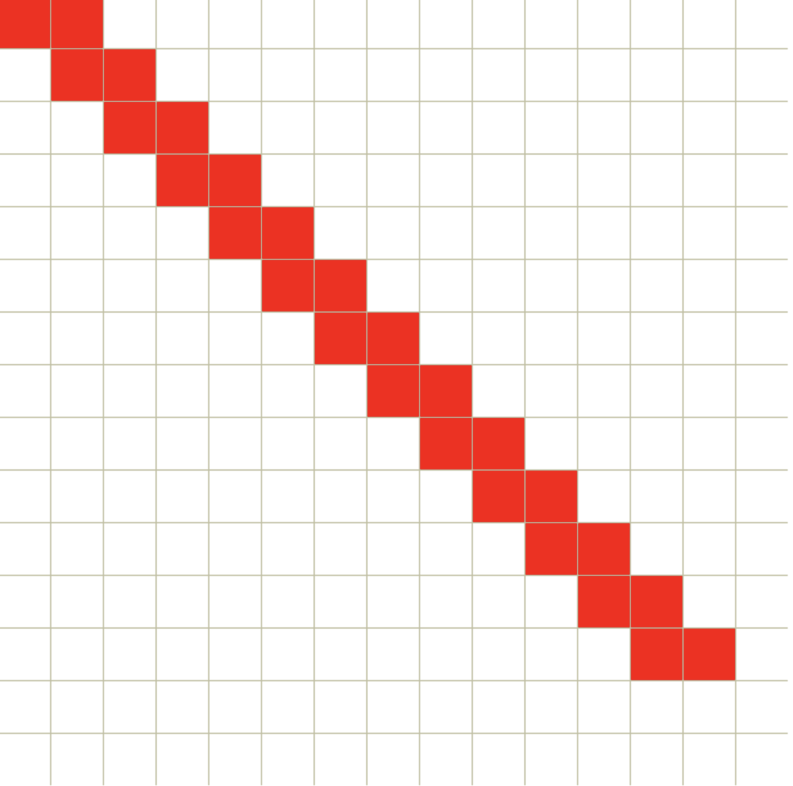
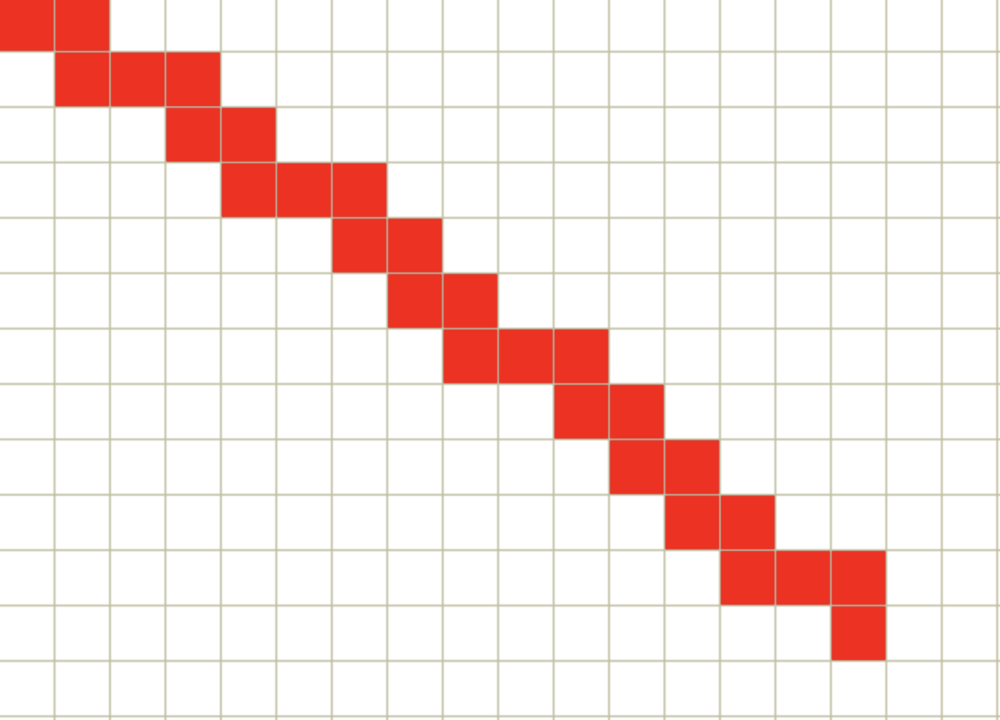
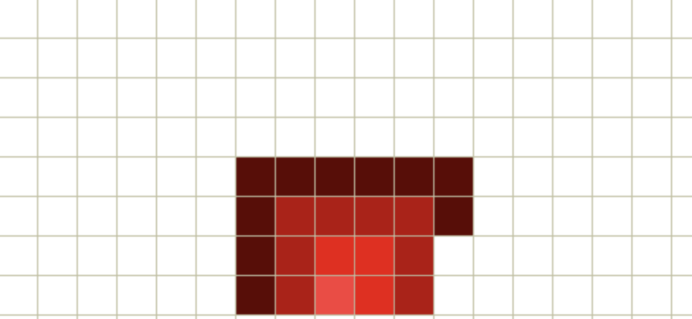
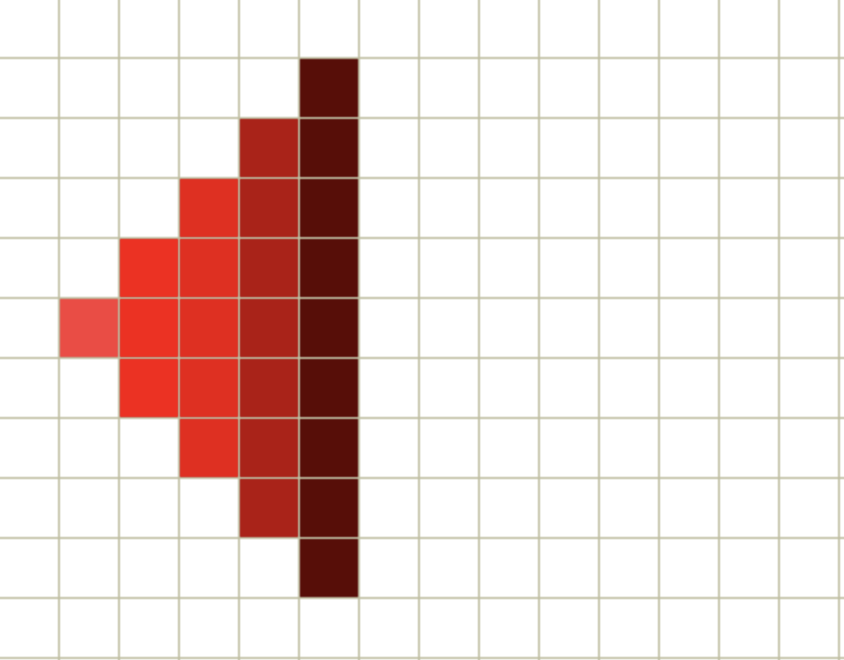
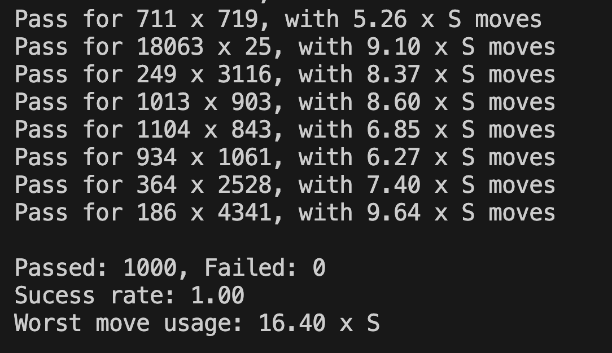

# Blind Snake Problem

The **Blind Snake Problem** is a challenge that involves navigating a snake toward an apple placed randomly on a grid with unknown dimensions. The task is to find the most efficient approach to guide the snake to its goal while adhering to certain efficiency constraints and limitations.

---

## Table of Contents

1. [Introduction](#introduction)

2. [Solution Approach](#solution-approach)
  
3. [Alternative Approaches](#alternative-approaches)

4. [Code Explanation](#code-explanation)

6. [How to Run the Code](#how-to-run-the-code)

---

## Introduction

Imagine playing a snake game on an old Nokia phone, with a screen of width **A** and height **B**. You control a small 1x1 snake that can move up, down, left, or right, starting from a random point on the screen. An apple (also 1x1 in size) is placed randomly somewhere else on the screen. If the snake hits the right edge and tries to move right, it reappears on the left edge, at a symmetrical position. The same happens for all edges: hitting the top border brings the snake to the bottom, hitting the left border moves it to the right, and hitting the bottom border brings it back to the top. Your goal is to eat the apple, just like in the traditional "Snake" game, but there are important limitations:

- **Blind Gameplay:** You are playing with your eyes closed.
- **Unknown Grid Size:** The dimensions of the screen (A and B) are unknown, and the area \( S = A×B \) is also unknown.
- **Limited Control:** You can only send commands to the game by pressing "up," "down," "left," and "right" buttons.
- **Unknown Position:** You don't know your initial position, nor do you know your current position at any given time in the game.
- **Unknown Apple Location:** The position of the apple is also unknown.
- **Game Feedback:** You can only tell you've found the apple when your snake’s position coincides with the apple's position. This triggers a sound from the phone, alerting you that the apple has been eaten.
- **Game Over Conditions:** If you use more than \( 35×S \) left/right/up/down commands (where S = A×B ), you lose the game.

**Important Notes:**
- The screen can be any size, from \( 1×20 \) to \( 5000×5000 \), with A and B being positive integers.
- \( S = A×B \) is always less than 1,000,000.
- You cannot exceed \( 35×S \) steps, regardless of the grid shape (e.g., 1×1000000, 1000000×1, 1000×1000, etc.).
- No extra notifications or border crossings are allowed; the snake moves on a toroidal grid, where crossing any edge results in the snake reappearing on the opposite side.

---

## Solution Approach

This challenge essentially involves finding an efficient method to explore every cell on an unknown-sized grid (the game board). Finding a single cell with an apple is trivial once we’ve solved the grid traversal problem.

### Thought Process

We will denote the product of the board's dimensions A×B as S.

Since the game board behaves as a torus (crossing one edge brings you to the opposite edge), we can simplify our movements. We start with the snake at the top-left corner and focus only on movements to the right and down, disregarding movements to the left or up.

To ensure efficient coverage of the grid and avoid unnecessary repetitions, the goal is to follow a "staircase" pattern: alternating between moving right and down (right-down-right-down, etc.). This guarantees that every move has the potential to uncover a new field.

**Stair pattern illustration:**




### Key Concepts and Ideas

**Coverage Guarantee:**
By consistently alternating between right and down, we ensure that new fields are uncovered with each step. With this approach, any board can theoretically be solved in fewer than 2×S  moves, even if some fields are revisited.

**Avoiding Infinite Loops:**
Infinite loops occur when the grid's dimensions A and B are not coprime (gcd(A,B)≠1). To prevent this, we periodically "switch lanes" by altering the direction or step size.

**Adapting to Board Size:**
Simply using a fixed step coefficient (e.g. 3, 5 or 100) is insufficient since there will always be some board dimensions that cause looping. A dynamic approach is necessary:

 - Small boards require small step coefficients.
 - Larger boards require larger step coefficients.

**Step Coefficient Selection:**
To ensure adaptability, the step coefficient starts small and grows incrementally over time. Specifically:

Begin with a coefficient of 1 and increase it by 1 each time the snake moves to a new lane.
This gradual increase allows the snake to adjust its course frequently on smaller boards while also accommodating larger boards as the game progresses.

**Stair pattern with adaptive step illustration:**



This approach minimizes the chances of revisiting the same fields excessively. Even if we return to a previous lane, the difference in the "staircase" movement size ensures that new fields are likely to be uncovered.

This approach also works with other step increment tactics, such as doubling the step size. After experimenting with several options, I found my solution to be the most efficient, although there may still be an even better approach.

### **Efficiency of the Solution: Time Complexity**

**Time Complexity: O(S)**  

Extensive testing across thousands of boards revealed that the worst-case scenario required approximately \(17×S\) moves for the engine to visit every field. This result is about two times more efficient than the theoretical limitation.  

When the game objective is modified to simply finding an apple (instead of covering the entire board), the number of iterations needed to win decreases significantly in most cases, further enhancing the solution's efficiency.  

---

## **Alternative Approaches**

#### **Circle/Spray Approach**

This alternative strategy involves moving in a circular or spray-like pattern (full or half). An illustration of this pattern is shown below:  

**Half circle pattern illustration:**



**Spray pattern illustration:**



**Pros:**
- Highly effective on boards where the dimensions \( A \) and \( B \) are similar (i.e., square-like boards).  
- Achieves near-optimal coverage with a time complexity of O(S), as the number of moves is close to S.  

**Cons:**
- On rectangular boards where \( A \) and \( B \) differ significantly, the repetition rate increases dramatically.  
- In the worst-case scenario (e.g.,  A=1 and B=S), it would require approximately S×(S+1)/2 moves to win. This results in a time complexity of O(S^2), which exceeds the task's limitations.  

--- 

## Code Explanation

The code defines a `Game` structure that accepts board dimensions as parameters and includes a boolean flag to determine the game's apple generation behavior. If the flag is set to `false`, the game generates an apple on every field; otherwise, only one apple is used. The `Game` structure includes a `Move` method, which takes a direction character as input and returns a boolean indicating whether the game was won and an error if the maximum number of moves (calculated as `S × 35`) is exceeded.

The `Engine` structure contains a field of type `Game`. A new game is initialized either when a new `Engine` instance is created or by calling the `SetNewGame` method. The `Play` method starts the game using the engine's heuristic.

The `Utils` package provides utility methods, such as those for generating random values.

The `main` method tests a specified number of board size combinations using multi-threading. It generates a report of the results based on the defined packages.

---

##  How to Run the Code

### Prerequisites
- **Go** (Golang)
  Make sure Go is installed on your system. You can check your Go version by running:
  ```bash
  go version
If Go is not installed, you can download and install it from the official [Go website](https://go.dev/dl/).

### 📦 Steps to Install

1. Clone the repository
  ```bash
  git clone https://github.com/IgorAmi52/Blind-Snake-Problem.git
   ```
2. Navigate to the main file directory
  ```bash
  cd blind-snake-problem/src
   ```
3. Build the solution
  ```bash
  go build -o blind-snake main.go
   ```
4. Run the executable file
  ```bash
  ./blind-snake
   ```
### Output
The program will run tests and display results in the terminal, including the success rate and the maximum number of moves required to complete the game for different board sizes.


